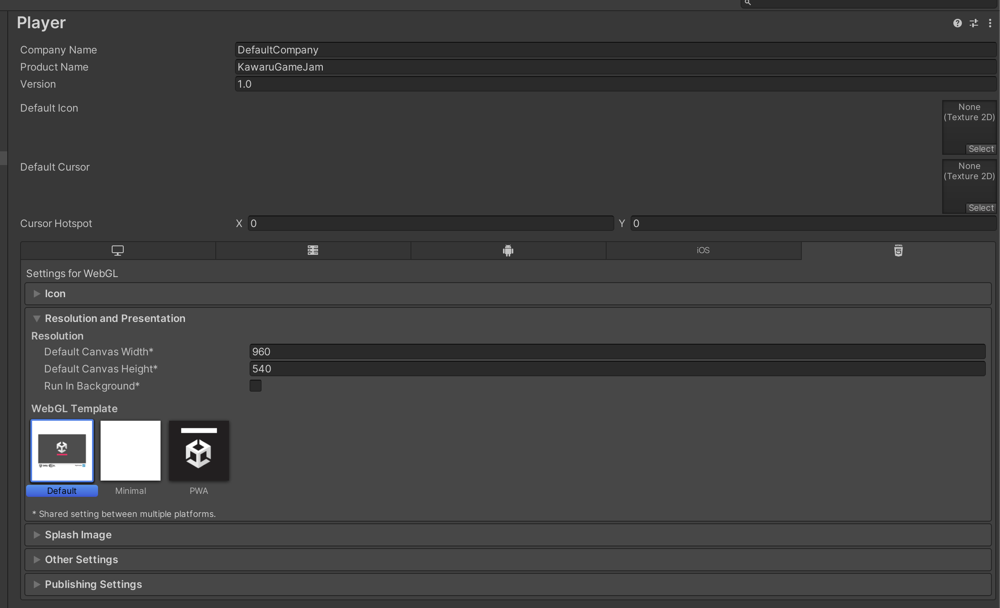

# kawaru_unity_game_jam

## ゲーム内容

- タイトル：「かわる〜変装の達人〜」
- ゲームジャンル：「文字を変更するゲーム」
- ゲーム平均クリア時間：10 分
- 作成経緯：昔の UnityGameJam のお題からゲームを作成していく
- 作成日時・期間：2024 年 03 月 18 日開始　期間：
- 投稿 URL：「」
- 2024 年 03 月 18 日からの UnityGameJam 作品用リポジトリ

## ゲーム詳細内容

表示された文章の一部を書き換えて，他のものに書き換えるゲーム．

## 機能追加・改善・修正・エラーについて

- [機能追加・改善・修正・エラーについて](document/NewAdd_ErrorList.md)

## UnityGameJam に適した設定

### ビルドを Gzip にする方法

- Player Setting → Player → Publishing Settings → Compression Format を Gzip に変更

### 画面サイズの設定

- 960 x 540

- KeepAspect でカメラの見ているアスペクト比を固定する．

## 参考・参照・引用

1. [WebGL のビルドで Gzip に変更する方法](https://qiita.com/YutakakINJO/items/a7b3b6a8325004ba24cb)
